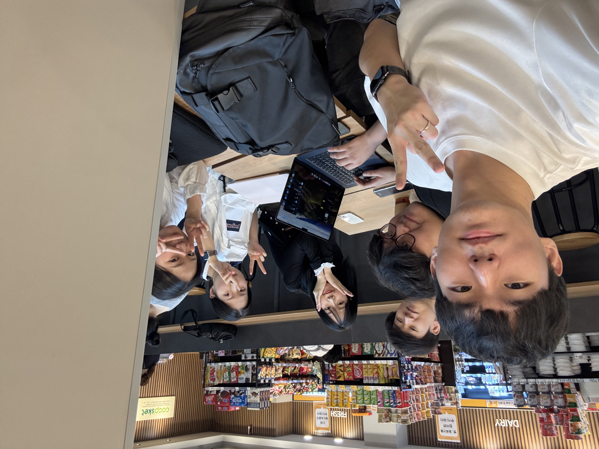
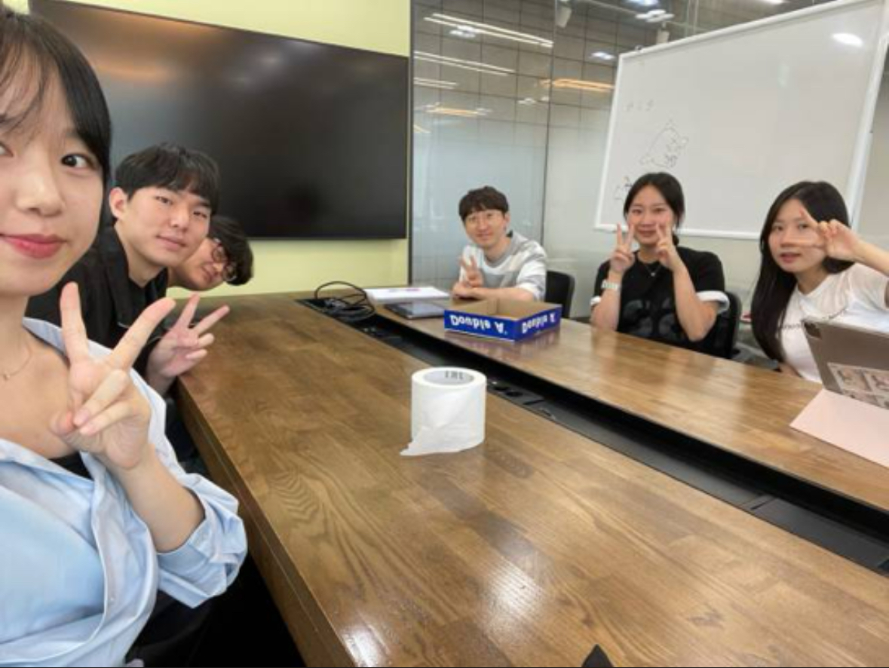

# 유레카 프로젝트 1분반 5조
## 팀 소개
### 공통 관심사 : 웹개발
### 슬로건 : 한 줄의 코드로 세상을 변화시키다.
의미 : 간단한 코드 한 줄이 세상을 더 나은 방향으로 변화시킬 수 있다는 가능성을 상징합니다. 작은 변화가 모여 큰 혁신을 이끌어낼 수 있다는 메시지를 담고 있습니다.

결정한 이유 : 팀의 개발 철학과 가치관을 반영하여, 코드 한 줄이라도 세상에 긍정적인 변화를 줄 수 있다는 믿음에서 이 슬로건을 결정했습니다. 간결함과 영향력의 중요성을 강조하고자 했습니다.

### 팀원 소개

| **이름**  | **학번** | **전공** | **관심사** | **현재 하고있는 공부** |
| --- | --- | --- | --- | --- |
| 김도훈 | 20192208 | 정보보안암호수학과 | 웹 백엔드 개발, 스프링, 자바 | 토비의 스프링, 알고리즘 |
| 김승언 | 20212677 | 소프트웨어전공 | 백엔드 서버 개발/데이터 | 알고리즘 |
| 민수림 | 20222105 | 정보보안암호수학과 | 웹 해킹 및 취약점 분석 | 웹 개발 및 웹 취약점 공부 |
| 임장혁 | 20190269 | 한국역사학과 | 웹, 백엔드 개발, 자바, 클라우드 | 백엔드, 스프링, 클라우드 |
| 조민정 | 20231895 | 소프트웨어전공 | 웹, 프론트엔드 개발 | 프론트엔드(HTML, CSS, JS) |

## 활동 내역
### 수행 활동 체크리스트
✅ 팀 소개 및 계획에 대한 발표

✅ 대학원생 면담(1)

✅ 대학원생 면담(2)

✅ 보직교수님 면담

✅ 3, 4학년 과목 담당 교수님 면담

✅ 행정실 탐방

✅ 정보통신처 탐방

✅ 학과 서비스 이용 및 서버실 탐방

✅ 멘토링 활동

## 인상 깊었던 활동
### 대학원생 면담(2)
#### 대학원생 성함: 천성규
#### 일시: 2024/09/19, 오후 3시
#### 참석 인원: 5/5

- 팀의 관심사 중 어떤 것을 알아보려고 했는가?
  - 웹개발, 인공지능, 대학원, 수강과목 정보

- 팀이 원하는 커리어를 이루기 위해 연구실이 필요할까요?
  - 웹 개발자로써 실무에 중점을 두고 싶다면 맞지 않다는 생각이 듭니다. 하지만 웹 개발에 있어서 나오는 기술들의 이론적인 부분들을 연구하고, 발전시키고 싶은 목적이라면 필요하다고 생각합니다.

- 소감 한마디
  - 대학원에서 무엇을 배우고, 어떤 분야가 있는지 알 수 있었으며, 취업말고도 다른 길을 볼 수 있었다.

- 활동 사진

### 3, 4학년 과목 담당 교수님 면담
#### 교수님 성함: 박하명 교수님
#### 일시: 2024/09/24, 오후 4시
#### 참석 인원: 5/5

- 팀의 관심사 중 어떤 것을 알아보려고 했는가?
  - 진로고민과 학교에서 제공되는 비교과프로그램, 소프트웨어 커리큘럼

- 질문: 웹 서버 개발자를 목표로 하고 있는데, AI 기술을 적용하는 기업에서 서버 개발자가 갖춰야 할 역량과 역할이 무엇인지, 그리고 대학웑 진학이 제 미래에 도움이 될지 고민됩니다.
  - 웹 서버 개발자를 진로로 삼는다면, 대학원을 가는 게 큰 도움이 되지는 않을 것이다. 연구를 하기 위해 대학원에 진학하는건데, 웹 서버 개발자가 되려고 굳이 대학원에서 해야 할 업무가 있나 생각하면 딱히 없는 것 같다. 그리고 웹 서버 개발자 전망의 경우, 계속 수요가 있긴 하나 요즘에 AI 기술 같은 것들이 워낙 많이 발전되다 보니 그런 AI 기술을 활용해서 웹 서버 관련된 기술을 빨리 만들어 처리할 수 있는 사람이 좀 필요할 것 같다.

- 소감 한마디
  - 소감: 남은 학기동안 어디에 중점을 두고 공부를 해야하는지 알 수 있는 시간이었다.

- 활동 사진

### 정보통신처 탐방
#### 일시: 2024.10.31 오후 4시
#### 참석 인원: 5/5
- 팀의 관심사 중 어떤 것을 알아보려고 했는가?
  - 보안이나 관제가 어떻게 이루어지는지

- 질문: 정보통신처에서는 상시로 보안 관제를 하나요?
  - 상시로 모니터를 확인하면서 이상이 있는지 감지를 합니다. 그리고 이상이 있다면 메일 같은걸로 알림이 오게 됩니다.

- 소감 한마디
  - 실제로 학교의 서버실을 볼 수 있는 경험을 할 수 있어서 좋았다.

- 활동 사진

### 멘토링 활동
#### 일시: 2024.11.25 오후 7시
#### 참석 인원: 5/5
- 팀의 관심사 중 어떤 것을 알아보려고 했는가?
  - 웹개발자로 취업하기 위한 질문.

- 질문: 백앤드 개발자로 취업하기 위해서 준비하고 있는데 요즘 백엔드 개발자의 취업 시장이 어떠한지 궁금합니다. 그리고 취업을 위해 어떤 걸 해야하는지 궁금합니다.
  - 시장이 얼어있다. 산업의 사이클이나 여러가지 국제 정세로 인해서 it 기반의 회사들이 몸을 사리고 있고 그게 1년이 넘었다.전통적인 it기업을 노리기 보다는 현대차, cj 계열(올리브영) it 시스템, 티빙, 쿠팡 등의 기업들도 노려보는것이 좋다.사에 취업하면 직무전환의 기회가 많이있다. 컴공에서 다루고 있는 주요 과목(데베, 운체, 자료구조, 컴네 등) 이론에 대해서 잘알고 있어야 한다.

- 소감 한마디
    - 현직에 계신 분의 조언을 직접 들을 수 있어서 너무 유익한 시간이었다. 늦게 시스템을 이용한 게 매우 아쉬웠습니다. 나중에 진로고민이 있을 때, 다시 멘토링 받고 싶다.

- 활동 사진
